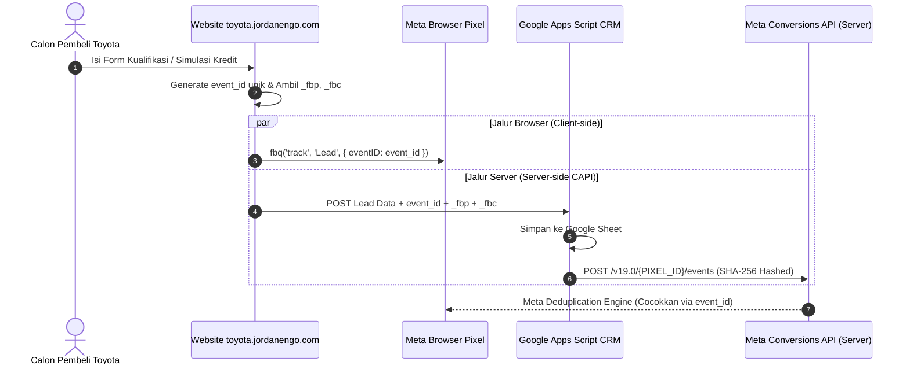

# Panduan Lengkap Meta Pixel & Conversions API (CAPI)
### Tunas Toyota Jabodetabek • Mathew Jordan (PT Tunas Ridean Tbk)
**Domain:** `https://toyota.jordanengo.com`  
**Status Website:** ✅ Sudah terpasang bridge dual-tracking (Browser Pixel + Server CAPI) dengan deduplikasi otomatis `event_id`.

---

## 1. Mengapa Website Ini Menggunakan Dual Tracking (Pixel + CAPI)?

Karena kebijakan privasi Apple (iOS 14.5+ ATT), proteksi Safari (ITP), dan ad blocker pada smartphone, pelacakan browser biasa kehilangan **30% hingga 50% data lead**.

Dengan arsitektur **Dual Tracking + Deduplikasi**:
1. **Browser Pixel (`fbq`):** Mengirimkan event secara instan dari browser calon pembeli.
2. **Server-side CAPI (`Graph API`):** Saat form kualifikasi / simulasi kredit disubmit, backend (Google Apps Script) mengirimkan event identik langsung dari server Google ke server Meta dengan data terenkripsi SHA-256 (`phone`, `name`, `city`, `_fbp`, `_fbc`).
3. **Deduplikasi Otomatis:** Keduanya menggunakan `event_id` yang sama persis (misal: `hero_quiz_lead_1725700000_abc`). Meta menggabungkan keduanya menjadi **1 event valid** dengan **Event Match Quality (EMQ) 8.5 – 9.5 / 10**!



---

## 2. Langkah 1: Ambil Pixel ID & Access Token di Meta Events Manager

Lakukan langkah ini di dashboard Meta Business Manager Anda:

1. Buka [Meta Events Manager](https://business.facebook.com/events_manager2).
2. Pilih akun bisnis Anda dan klik menu **Data Sources (Sumber Data)** di sebelah kiri.
3. Pilih Pixel Anda (atau klik **Create / Connect Data** jika belum punya Pixel):
   - Salin **Dataset ID / Pixel ID** (berupa 15-16 digit angka, misal: `123456789012345`).
4. Klik tab **Settings (Pengaturan)** pada Pixel tersebut:
   - **Nyalakan Automatic Advanced Matching:** Geser tombol ke **ON**, centang semua: *Email, Phone Number, First and Last Name, City, Country*.
5. Scroll ke bawah ke bagian **Conversions API (API Konversi)**:
   - Pada judul *"Set up direct integration (Siapkan integrasi langsung)"*, klik link biru **"Generate access token (Buat token akses)"**.
   - Salin token panjang tersebut (berawalan `EAAG...`). Simpan di catatan aman.

---

## 3. Langkah 2: Aktifkan Browser Pixel di Website

Buka file [index.html](file:///home/jordan/Projects/toyota/index.html#L160-L185), cari blok `window.TOYOTA_CONFIG.tracking`:

```javascript
window.TOYOTA_CONFIG = {
  // ...
  tracking: {
    debug: false,
    ga4_id: "G-XXXXXXXXXX",
    google_ads_id: "AW-XXXXXXXXXX",
    meta_pixel_id: "123456789012345", // ⬅️ Masukkan Pixel ID Meta Anda di sini
    enhanced_conversions: true,
    conversion_labels: {
      hero_quiz_lead: "",
      credit_calc_lead: "",
      whatsapp_click: ""
    }
  }
};
```

Website akan secara otomatis:
- Memuat script resmi `connect.facebook.net/en_US/fbevents.js` secara asynchronous non-blocking.
- Mengirimkan event `PageView` saat halaman terbuka.
- Mengirimkan event `Lead` saat Hero Quiz disubmit (dengan `eventID`).
- Mengirimkan event `CustomizeProduct` saat Simulasi Kredit disubmit (dengan `eventID`).
- Mengirimkan event `WhatsAppContact` saat tombol WhatsApp diklik.

---

## 4. Langkah 3: Aktifkan Server-Side CAPI di Google Apps Script (CRM Webhook)

Karena website Anda sudah memiliki endpoint serverless di [google_apps_script.js](file:///home/jordan/Projects/toyota/google_apps_script.js), Anda **tidak perlu menyewa VPS atau server tambahan**. Google Apps Script akan bertindak sebagai relay CAPI otomatis.

### Cara Aktivasi di Google Apps Script:
1. Buka spreadsheet CRM Toyota: [Google Sheet CRM](https://docs.google.com/spreadsheets/d/10bdJgupeYWTA_pHQ-qGjIlANb-dmR8yHyOisdbQc1e0/edit).
2. Klik **Extensions (Ekstensi)** → **Apps Script**.
3. Di dalam editor Apps Script, cari variabel `META_CONFIG` di bagian bawah:
   ```javascript
   var META_CONFIG = {
     pixel_id: "123456789012345",         // ⬅️ Masukkan Pixel ID Anda
     access_token: "EAAG...",             // ⬅️ Masukkan Access Token CAPI Anda
     test_event_code: ""                  // Kosongkan saat live, isi hanya saat testing
   };
   ```
   *(Atau masukkan lewat menu **Project Settings (ikon gerigi)** → **Script Properties** dengan key `META_PIXEL_ID` dan `META_CAPI_TOKEN`)*.
4. Klik tombol **Save (ikon disket)**.
5. Klik **Deploy** (di pojok kanan atas) → **Manage deployments** → Klik ikon pensil Edit → Pilih versi **New version** → Klik **Deploy**.

Setiap kali ada prospek yang mengisi quiz atau simulasi kredit, Google Apps Script akan:
1. Menyimpan data prospek lengkap ke baris Google Sheet.
2. Melakukan enkripsi **SHA-256** pada nomor WhatsApp, nama, dan domisili.
3. Menembak server Meta via HTTP POST ke endpoint `https://graph.facebook.com/v19.0/{PIXEL_ID}/events` dengan `event_id`, cookie `_fbp`, `_fbc`, dan user agent.

---

## 5. Langkah 4: Pengujian & Verifikasi Deduplikasi (Test Events)

Sebelum beriklan, lakukan tes integrasi agar Anda yakin browser dan server terhubung sempurna:

1. Di Meta Events Manager, klik tab **Test Events (Uji Peristiwa)**.
2. Di bagian *"Confirm your server events are set up correctly"*, salin **Test Code** (misal: `TEST78910`).
3. Tempelkan kode tersebut ke `META_CONFIG.test_event_code = "TEST78910"` di Google Apps Script, lalu Save & Deploy.
4. Buka website Toyota di browser Anda:  
   `https://toyota.jordanengo.com/?debug_tracking=true`
5. Isi formulir kualifikasi hero hingga selesai (Step 1 s/d Step 4) dan klik Submit.
6. Lihat tab **Test Events** di Meta:
   - Anda akan melihat event **Lead** masuk dari **Browser** (`fbq`).
   - Beberapa detik kemudian, event **Lead** masuk dari **Server** (Google Apps Script).
   - Meta akan menampilkan status icon **"Deduplicated"** (Digabungkan).
7. Jika status sudah Deduplicated, hapus kembali `test_event_code` di Apps Script agar kembali ke mode produksi live.

---

## 6. Alternatif Jalur Cloudflare Worker (Opsional)

Jika domain Anda `toyota.jordanengo.com` dihubungkan melalui Cloudflare DNS dengan proxy oranye aktif, Anda juga bisa menempatkan Cloudflare Worker sebagai reverse proxy CAPI. Kode template Worker sudah disiapkan di bawah ini jika dibutuhkan:

```javascript
export default {
  async fetch(request, env) {
    if (request.method === "POST" && new URL(request.url).pathname === "/api/meta-capi") {
      const body = await request.json();
      const ip = request.headers.get("cf-connecting-ip") || "";
      const ua = request.headers.get("user-agent") || "";
      
      // Inject IP dan User Agent dari Edge Cloudflare
      body.data[0].user_data.client_ip_address = ip;
      body.data[0].user_data.client_user_agent = ua;

      const metaRes = await fetch(`https://graph.facebook.com/v19.0/${env.META_PIXEL_ID}/events?access_token=${env.META_CAPI_TOKEN}`, {
        method: "POST",
        headers: { "Content-Type": "application/json" },
        body: JSON.stringify(body)
      });
      return new Response(await metaRes.text(), { status: metaRes.status, headers: { "Content-Type": "application/json" } });
    }
    return new Response("Not Found", { status: 404 });
  }
};
```
*(Namun metode Google Apps Script yang sudah aktif di atas jauh lebih praktis karena langsung terintegrasi dengan Google Sheet).*

---

## 7. Rekomendasi Format Kampanye Meta Ads (Instagram & Facebook)

Untuk Mathew Jordan / Tunas Toyota Jabodetabek, gunakan struktur kampanye dengan performa tertinggi:

1. **Tujuan Kampanye (Campaign Objective):** **Leads (Prospek)**.
2. **Lokasi Konversi (Conversion Location):** Pilih **Website** (`toyota.jordanengo.com`).
3. **Peristiwa Konversi (Conversion Event):** Pilih **Lead** (yang ditargetkan oleh CAPI kita).
4. **Targeting Audiens:**
   - Lokasi: Jakarta, Bogor, Depok, Tangerang, Bekasi (radius 40 km).
   - Usia: 26 – 55 tahun.
   - Demografi & Minat (Advantage+ Audience dengan saran minat): *Toyota Avanza, Toyota Innova, Toyota Fortuner, Car finance, Kredit Pemilikan Kendaraan, Astra International, Otomotif*.
5. **Format Iklan Terbaik:**
   - **Reels 9:16 Video:** Mathew Jordan memperkenalkan unit ready stock di showroom Hayam Wuruk dengan hook: *"Mau beli Avanza / Zenix tapi takut data leasing ditolak? Konsultasi gratis sekarang, data dibantu sampai ACC!"*
   - **Carousel 1:1:** Slide 1 Innova Zenix Hybrid (Cicilan 7 Jt), Slide 2 Avanza Veloz (DP 15 Jt), Slide 3 Fortuner GR (Bunga 0%), Slide 4 Raize Turbo (Bonus Dashcam).
